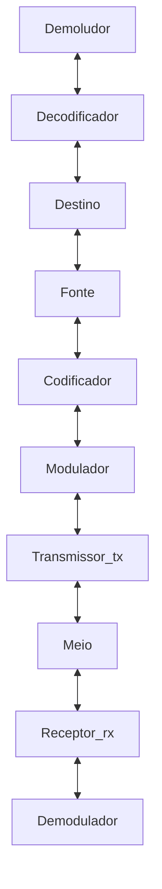

# INTRODUÇÃO A COMUNICAÇÃO DE DADOS

    ➤ Comunicação: processo pelo qual a informação é transmitida da fonte, através de determinado tempo e espaço, até um destino.
    ➤ Mensagem: manifestação fisica da informação produzida pela fonte.
    ➤ Sinal:

    ➞ finalidade de um sistema de comunicação é fazer uma replica aceitável da mensagem.

    ➞ em uma transmissão, sempre haverá:
        • atenuação = redução da intensidade
        • distorção = alteração do sinal
        • interferência = contaminação por sinais estranhos
        • ruído = sinais elétricos aleatórios ou imprevisìveis

# COMPONENTES DE UM SISTEMA DE TELECOMUNICAÇÃO

      FONTE 🡪 codificador 🡪 modulador 🡪 tx (transmissor) 🡪 MEIO 🡪 rx (receptor)🡪 demodulador 🡪 decodificador 🡪 DESTINO 
      DESTINO 🡨 decodificador 🡨 demodulador 🡨 rx (receptor) 🡨 MEIO 🡨 tx 🡨 modulador 🡨 codifificador 🡨 FONTE     <--| 

      • codificador e decodificador = dispositivos responsáveis pela codificação e decodificação de sinais, para fins de processamento 
        e telecomunicação, cujas principais funções são a detecção e correção de erros
      • modulador e demodulador = dispositivos responsaveis pela conversão de um formato de sinal para outro, entre fonte e destino
      • transmissor = dispositivo que acopla sinal ao meio fisico
      • receptor =
      • meio de transmissão
            ➞ fios metálicos,    
            ➞ espaços,
            ➞ luz,    
        
    🢂 tipos de comunicação**
        • humano - humano
        • humano - máquina
        • máquina - máquina
    
    🢂 tipos de transmissão: 
        • unidirecional = canal de comunicação, exemplo: rádio, tv
        • bidirecional = circuito de comunicação, exemplo telefone
    
    🢂 sentido da transmissão
        • simplex =  
        • duplex - o meio conduz o sinal nos dois sentidos
            🡪 half-duplex = o meio conduz o sinal em ambos os sentidos mas não simultaneamente
            🡪 full-duplex = o meio conduz o sinal em ambos os sentidos e ao mesmo tempo
                                                                                            
