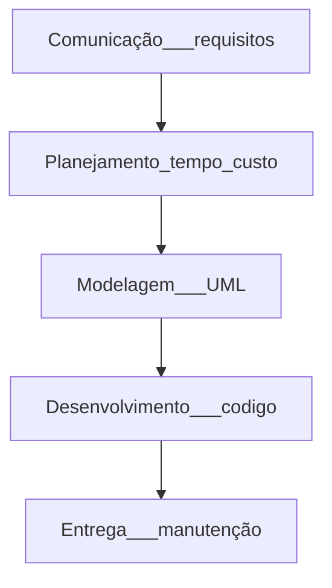
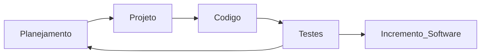

# REVISÃO
  
  **ENGENHARIA DE SOFTWARE**

  **METÓDOS - ou C.V.D.S**

    ➤ PRESCRITIVOS/TRADICIONAIS                      ➤  ÁGEIS
    • cascata                                              • mudanças
    • V                                                    • flexibilidade
    • incremental                                          • entregas frequentes  
    • prototipação                                         • equipes menores
    • espiral                                              • ciclos de revisão
    • modelos:                                             • modelos:
      ➞ modelos mais rigidos                                 ➞ X.P
                                                              ➞ SCRUM
                                                              ➞ DSDM
                                                              ➞ F.D.D
                                                              ➞ DenOPs
**XP**

                       PROJETO
                  🡽           🡾
        PLANEJAMENTO           CODIGO
                  🡼            🡿
                       TESTES
                         🡻
                    incrementto de software

# MODELOS DE PROCESSOS ÁGEIS

**➤ DYNAMIC SYSTEMS DEVELOPMENT METHOD - DSDM**

        *FIGMA = FERRAMENTA PARA CRIAÇÃO
        🡺 principio de pareto = 
        CICLO DE VIDA DSMS
        
            • criação de um prototipo - para entender o que o cliente quer 
 

**➤ FEATURE DRIVEN DEVELOPMENT - FDD**

    🡺desenvolver um modelo geral - ver o que o cliente quer 
    🡺 lista de funcionalidade de acordo com o modelo geral
    🡺 planejar por funconalidade e distribuir - ordena por prioridade as funcionalidades, GANTT, 
    *esses 3 passos anteriores seria como se fosse o backlog do scrum

    *ciclo
    🡺 projetar por funcionalidade
            🡻      🡹 
    🡺 desenvolver por funcionalidade
            🡻      🡹
    🡺  entrega

**➤ KANBAN**
      
      🡺TRELLO

**➤ RATION UNIFIED PROCESS - RUP**
      
      🡺 definição:
      🡺 perspectiva dinâmica
      🡺 perspectiva estatica
      🡺 perspectiva prática

      🡺 fases no rup
        • concepçao
        • elaboração
        • construção = projeto + programação
        • transição - implementação

      🡺 Visão estática do RUP
        *cassos de usos = tecnica de modelagam de requisitos como se se fosse historia de usuario
            

