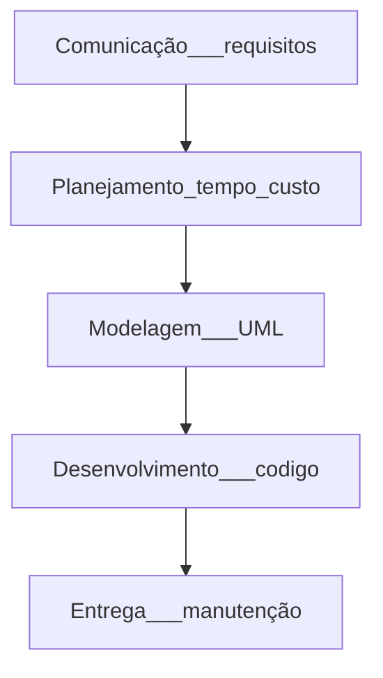

# Revisão

## Engenharia de software
## Engenharia de Requisitos

    🡺 tarefas e tecnicas que leva a um entedimentos dos requisitos (Pressman, 2021)
        ➞ concepção - necessidade de negócio, oportunidade
              🡻
        ➞ levantamento - elicitação
              🡻
        ➞ elaboração - refinar / remover opostos
              🡻
        ➞ Negociação - cliente
              🡻
        ➞ Especificação - detalhar
              🡻
        ➞ Validação - revisar
              🡻
        ➞ Gerenciamento - mudanças
        
        *A elicitação de requisitos é o processo de buscar, descobrir, adquirir, elaborar requisitos para sistemas baseados em computador (Zowgui e Coulin, 2005).
    
    🡺 Técnicas: 
            ➞ histórias de usuário
            ➞ cenários (UML)
    🡺 Questionários:
            ➞ Scrainstorm
            ➞ entrevistas
            ➞ reuniões
            ➞ J.A.D
