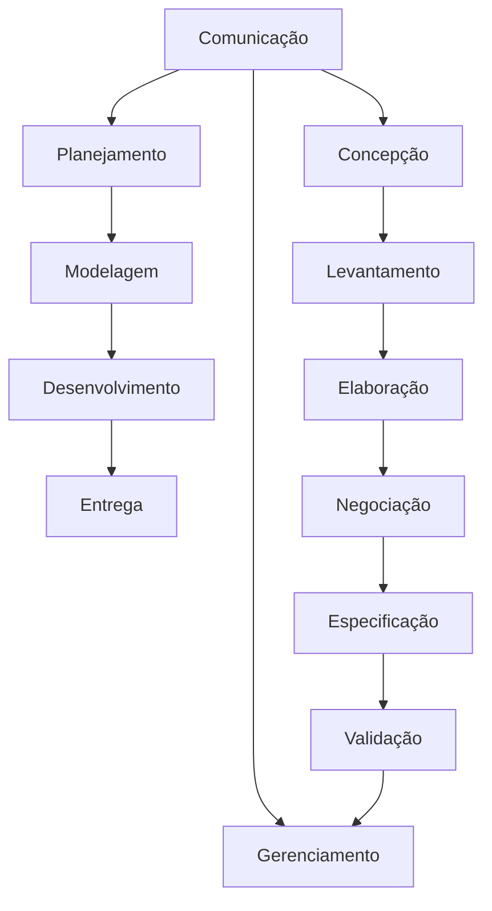

# Engenharia de Software e Engenharia de Requisitos

## Engenharia de requisitos

    🡺 "tarefas e tecnicas que leva a um entedimentos dos requisitos" (Pressman, 2021)
        ➞ concepção - necessidade de negócio, oportunidade
        ➞ levantamento - elicitação, buscar a maior quantidade de informações, idependente de estarem corretas ou não
        ➞ elaboração - refinar/remover opostos, refinar as informações recolhidas na etapa anterior, verificar como vai querer o projeto final - quias as funcionalidades que vou usar, que talvez eu use mas preciso fazer ajustes e quais não vou usar
        ➞ Negociação - cliente, algo que o cliente queira utilizar e seja possivel de produzir
        ➞ Especificação - detalharo que o sistema vai ter, como vai ser, qual banco de dados vai usar --> codigo, caracteriticas de qualidade, funcionalidade 
        ➞ Validação - revisar
        ➞ Gerenciamento - mudanças

        **elicitação de requisitos é o processo de buscar, descobrir, adquirir, elaborar requisitos para sistemas baseados em computador (Zowgui e Coulin, 2005).
        
    🡺 Técnicas: 
            ➞ histórias de usuário
            ➞ cenários (UML)
    🡺 Questionários:
            ➞ Scrainstorm
            ➞ entrevistas
            ➞ reuniões
            ➞ J.A.D

# Engenharia de Requisitos

    🡺 "engenharia de requisitos é uma engenharia dentro da engenharia de software, como um capitulo"

    🡺 o que são requisitos: 
        • "requisitos de um sistema são as descrições do que o sistema deve fazer, os serviços que oferece e as restrições a seu funcionamento"
        • "condição ou capacidade que um sistema ou componente deve alcaçar ou possuir para satisfazer um contrato, padrão especificação ou outro documento formalmente imposto"
        • " esses requisitos refletem as necessidades dos clientes para um sistema que serve a uma finalidade determinada, como controlar um dispositivo, colocar um pedido ou encontrar informações"

    🡺 o que é engenharia de requisitos - ER (requirements engineering):
        • é o processo de descobrir, analisar, documentar e verificar esses serviços e restrições.

    🡺 como identificar os requisitos:
            ➞ "Stakeholders" = todos os interessados no sistema ➞ possuem papel-chave na descoberta dos requisitos
            ➞ a partir dos domínios de negócios, utilizando técnicas variadas para obtençao de informações sobre os requisitos que um sistema deve ter.
            ➞ Domínio de negócio ou domínio do problema ou domínio da aplicação = área específica na qual o software será desenvolvido
                • domínio é a área de conhecimento ou atividades específica caracterizada por um conjunto de conceitos e terminologias compreendidos por especialistas da área, corresponde à parte do mundo real que é relevante para o desenvolvimento do software

## Análise de requisitos - problemas
    🡺 problemas a serem tratados com atenção no levantamento de requisitos:
            • comunicação do cliente com analista
            • evolução dos requisitos
            • gerenciamento de alterações
            • falta de conhecimento sobre o domínio

    🡺 o que é obtido pelo levantamento de requisitos:
            • documento que contém todos os requisitos que o sistema abarcará
            • documento escrito em notação informal ou em forma de caso de uso ➞ o que permite que indivíduos não tecnicos na área consigam compreender facilmente    

## Atividades do levantamento de requisitos
    ➞ três tipos de atividades realizadas no processo de levantamento de requisitos
    🡺 Elicitação dos requisitos
        • comunicação com os stakeholders para determinar quais são os requisitos de sistemas
    🡺 Análise de requisitos
        • determina o estado do requisito  (inacabado, incompleto, ambíguo, contraditório)
    🡺 Registro dos requisitos
        • documentar os requisitos de várias formas, como usando linguagem natural, casos ded uso, ou ainda processos de especificação

## Tipos de requisitos
     🡺 Os requisitos podem ser classificados em dois grandes grupos
          ➞ Requisitos funcionais - RF
          ➞ Requisitos não-funcionais - RNF
     

### REQUISITOS FUNCIONAIS - RF
     🡺 Definem as FUNCIONALIDADES do sistema ➞ especificam o que o sistema deve fazer.
     🡺 “Os requisitos funcionais de um sistema descrevem o que ele deve fazer. São declarações de serviços que o sistema deve fornecer, de como o sistema deve reagir a entradas específicas e de como o sistema deve se comportaremdeterminadassituações.”(SOMMERVILLE,2007)
     🡺Exemplo:
        ➞ [RF01] - O sistema deve permitir que os professores realizem o lançamento de notas e faltas dos alunos.
        ➞[RF02] - O sistema deve permitir a emissão do histórico escolar.
        ➞ [RF03] - Deve ser possivel emitir boletos para pagamentos das mensalidades dos cursos.

### REQUISITO NÃO-FUNCIONAIS - RNF
     🡺 indicam CARACTERÍSTICAS DE QUALIDADE que o sistema deve possuir que estão relacionados às funcionalidades previstas.
     🡺 “Os requisitos não funcionais, como o nome sugere, são requisitos que não estão diretamente relacionados com os serviços específicos oferecidos pelo sistema a seus usuários. Eles podem estar relacionados às propriedades emergentes do sistema, como confiabilidade, tempo de resposta e ocupação de área.”(SOMMERVILLE,2007)
     🡺 algumas características de qualidade:
            • desempenho
            • condiabilidade
            • escabilidade
            • portabilidade
            • usabilidade
            • segurança
     🡺 em geral os críterios que qualificam os requisitos não-funcionais são geralmente mensuráveis.
     🡺 classificação dos RNF, exemplos de categorias:
            ➞ Requisitos de Produtos: especificam ou restringem o comportamento do software
                • requisitos de usabilidade
                • requisitos de eficiência 
                • requisito de confiabilidade
                • requisito de portabilidade
            ➞ Requisitos Organizacionais: requisitos gerais de sistemas derivados das políticas e procedimentos da organização do cliente e do desenvolvedor
                • requisitos de entrega 
                • requisitos de implementação
                • requisitos de padrões
            ➞ Requisitos Externos: todos os requisitos que derivam de fatores externos ao sistema e seu processo de desenvolvimento
                • requisitos de interoperabilidade
                • requisitos éticos
                • requisitos legais

      🡺 exemplo de requisitos não-funcionais
            ➞ [RNF01] - o sistema poder ser acessado pela web
            ➞ [RNF02] - sistema seer implantado em python
            ➞ [RNF03] - o acesso ao sistema não pode demorar mais do que 10 segundos
            ➞ [RNF04] - professores devemser capazes de utilizar o sistema com um treinamento de 4horas
            ➞ [RNF005] - um aluno não poderá ter acesso aos dados dos outros alunos

### métricas para especificar requisitos não funcionais

## Requisitos funcionais X não-funcionais

## Técnicas para levantamento de requisitos
        🡺 diversas técnicas podem ser empregadas para realizar levantamento de requisitos em um projeto de sistemas:
            • Workshop de requisitos
            • Entrevistascomstakeholders
            • Questionários
            • Brainstorming
            • Prototipagem
            • Etnografia
            • JAD(Join Application Design)
            • VORD(Viewpoit-Oriented Requirements Definition)

# exercicio
    1. Crie um documento contendo os requisitos funcionais e não funcionais para o desenvolvimento de um sistema informatizado de uma biblioteca. Quanto aos requisitos não funcionais, liste no mínimo
    um para cada uma das propriedades : velocidade, tamanho, facilidadede uso, confiabilidade, robustez, portabilidade e segurança.
    2. Usando sua criatividade e seu imagine um software a serdesenvolvido e crie um documento contendo os seus requisitos.
    
    https://www.atlassian.com/software/confluence?gclsrc=aw.ds&&campaign=19281659951&adgroup=148074355881&targetid=kwd-98825694&matchtype=p&network=g&device=c&device_model=&creative=665271333048&keyword=confluence&placement=&target=&ds_eid=700000001542923&ds_e1=GOOGLE&gad_source=1&gclid=EAIaIQobChMI5bKnh-anjAMVvSRECB2OHDteEAAYASAAEgL3K_D_BwE
    https://professor.pucgoias.edu.br/sitedocente/admin/arquivosUpload/17785/material/IEEE830.pdf

