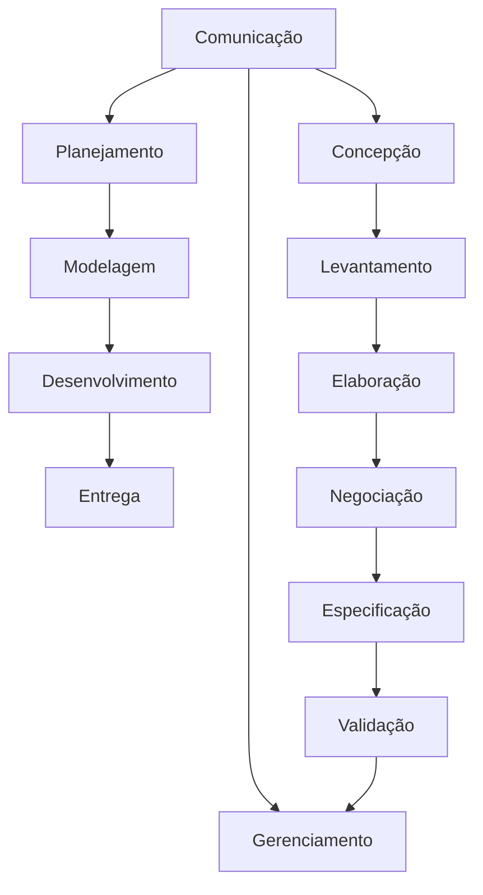

#Engenharia de software e Engenharia de Requisitos

**engenharia de requisitos**

    🡺 tarefas e tecnicas que leva a um entedimentos dos requisitos (Pressman, 2021)
        ➞ concepção - necessidade de negócio, oportunidade
        ➞ levantamento - elicitação
        ➞ elaboração - refinar / remover opostos
        ➞ Negociação - cliente
        ➞ Especificação - detalhar
        ➞ Validação - revisar
        ➞ Gerenciamento - mudanças
        **elicitação de requisitos é o processo de buscar, descobrir, adquirir, elaborar requisitos para sistemas baseados em computador (Zowgui e Coulin, 2005).
    
    🡺 Técnicas: 
            ➞ histórias de usuário
            ➞ cenários (UML)
    🡺 Questionários:
            ➞ Scrainstorm
            ➞ entrevistas
            ➞ reuniões
            ➞ J.A.D

# Engenharia de Requisitos

    engenharia de requisitos é uma engenharia dentro da engenharia de software, um capitulo
    🡺 o que são requisitos
    🡺 o que é engenharia de requisitos
    🡺 como identificar os requisitos:
            ➞ a partir dos domínios de negócios 

        ➞ concepção - necessidade de negócio, oportunidade
        ➞ levantamento - buscar a maior quantidade de informações, idependente de estarem corretas ou não
        ➞ elaboração - refinar as informações recolhidas na etapa anterior, verificar como vai querer o projeto final - quias as funcionalidades que vou usar, que talvez eu use mas preciso fazer ajustes e quais não vou usar
        ➞ Negociação - algo que o cliente queira utilizar e seja possivel de produzir
        ➞ Especificação - detalhar o que o jogo vai ter, como vai ser, qual banco de daos vai usar --> codigo 
                - caracteriticas de qualidade
                - funcionalidade 
        ➞ Validação - revisar
        ➞ Gerenciamento - mudanças

# exercicio
    1. Crie um documento contendo os requisitos funcionais e não funcionais para o desenvolvimento de um sistema informatizado de uma biblioteca. Quanto aos requisitos não funcionais, liste no mínimo
    um para cada uma das propriedades : velocidade, tamanho, facilidadede uso, confiabilidade, robustez, portabilidade e segurança.
    2. Usando sua criatividade e seu imagine um software a serdesenvolvido e crie um documento contendo os seus requisitos.
    
    https://www.atlassian.com/software/confluence?gclsrc=aw.ds&&campaign=19281659951&adgroup=148074355881&targetid=kwd-98825694&matchtype=p&network=g&device=c&device_model=&creative=665271333048&keyword=confluence&placement=&target=&ds_eid=700000001542923&ds_e1=GOOGLE&gad_source=1&gclid=EAIaIQobChMI5bKnh-anjAMVvSRECB2OHDteEAAYASAAEgL3K_D_BwE
    https://professor.pucgoias.edu.br/sitedocente/admin/arquivosUpload/17785/material/IEEE830.pdf

