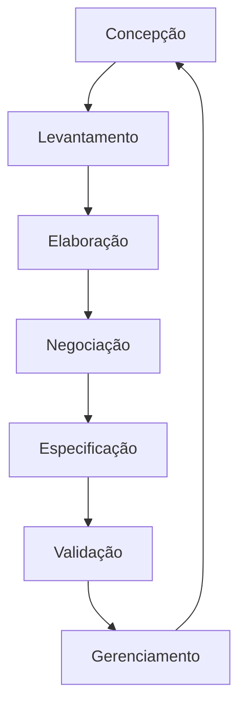

# Revisão

# História de requisitos
    🡺 COMO, tipo usuario, EU QUERO , meta/objetivo, PARA QUE beneficio/resultado
    🡺 COMO gerente de projeto , QUERO criar e atribuir tarefas aos membros de equipe PARA QUE eu possa acompanhar o progrresso do projeto e garantir que o tratamento seja concluido no prazo
