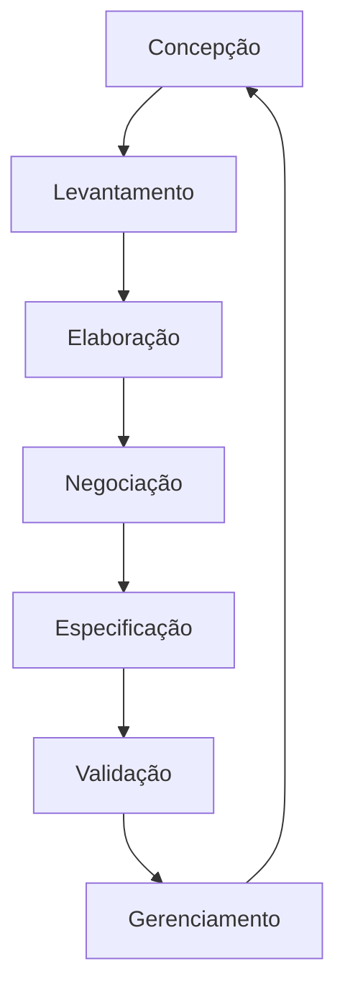

# Revisão

# História de requisitos
🡺 como, <ins>tipo usuario</ins>, eu quero, <ins>meta/objetivo</ins>, para que <ins>beneficio/resultado</ins>

🡺 como </ins>gerente de projeto</ins> , quero <ins>criar e atribuir tarefas aos membros de equipe</ins> para que <ins>eu possa acompanhar o progrresso do projeto e garantir que o tratamento seja concluido no prazo</ins>
