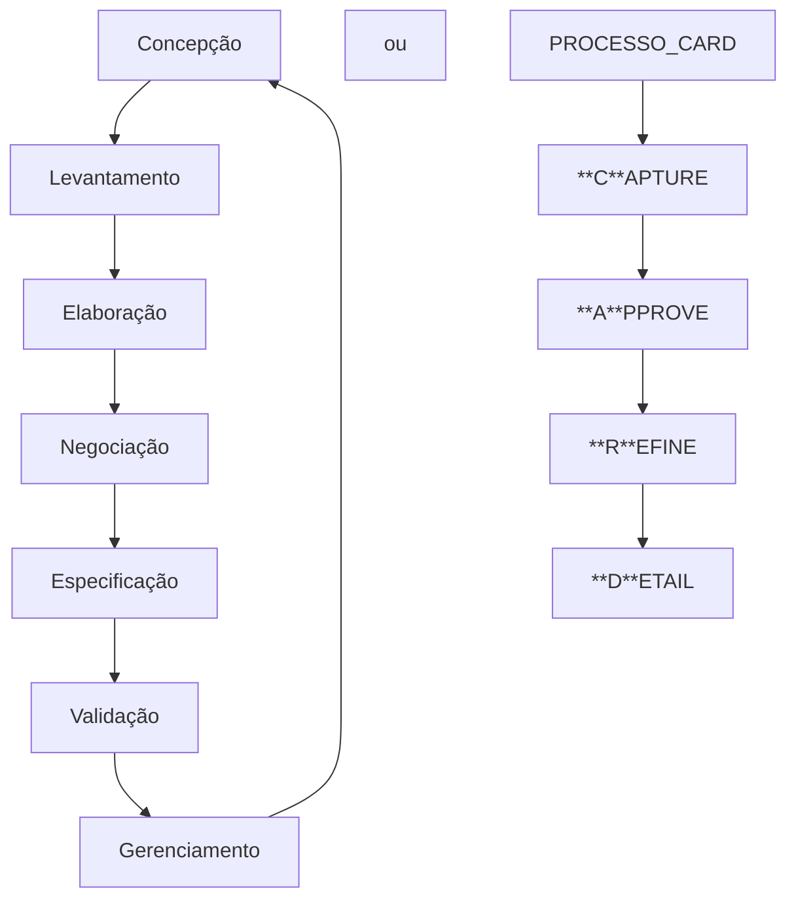

# Revisão

# História de requisitos
🡺 COMO, <ins>tipo usuario</ins>, EU QUERO, <ins>meta/objetivo</ins>, PARA QUE <ins>beneficio/resultado</ins>

🡺 COMO <ins>gerente de projeto</ins> , QUERO <ins>criar e atribuir tarefas aos membros de equipe</ins> PARA QUE <ins>eu possa acompanhar o progrresso do projeto e garantir que o tratamento seja concluido no prazo</ins>
