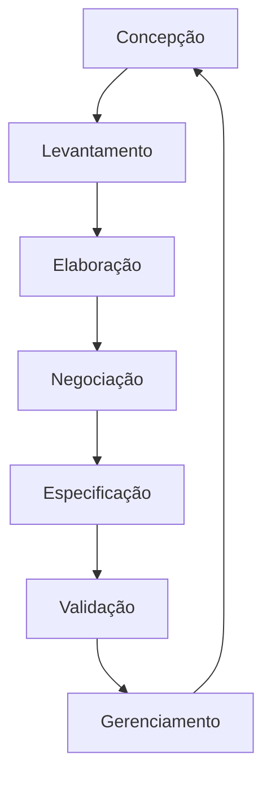
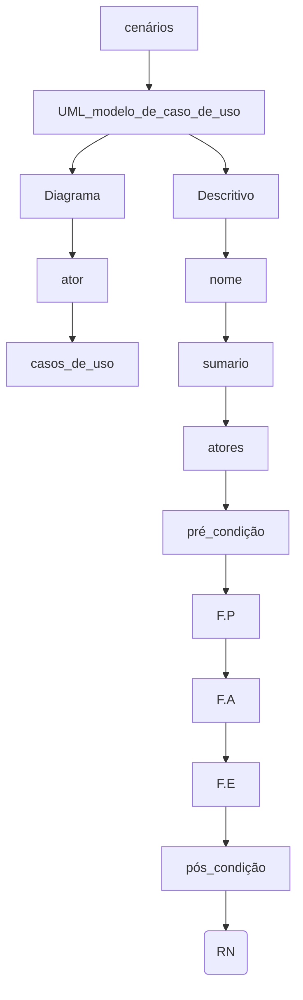

# REVISÃO 
## Engenharia de Requisitos

## Técnicas - história de usuario 

## Modelos de Casos de Uso - MCU
  
    ◘ é uma representação das funcionalidades externamentes observaveis dos sistema ...
    ◘ representa as funcionalidades
## CASOS DE USOS
    • é a especificação de uma sequencia completa de de interações entre um sistema e um ou mais agentes externos a esse sistema.
    • O formato de uma descrição de caso de uso diz respeito à estrutura utilizada para organizar a sua narrativa textual -  3 formas
        ◘ Descrição continua: 
            - exemplo: 
        ◘ Descrição numerada:
            - exemplo:
        ◘ Narrativa Fragmentada
            - exemplo:     
## CENÁRIOS 
    ◘ FORMA DE UTILIZAR UM SISTEMA
    ◘ Um cenário é a descrição de uma das maneiras pelas quais um caso de uso pode ser utilizado.
    ◘ Outra maneira de ver um cenário é como a descrição de um episódio de utilização de alguma funcionalidade do sistema. 
    ◘ Um cenário também é chamado de instância de um caso de uso.
    ◘ Uma coleção de cenários para um caso de uso pode ser utilizada posteriormente na fase de testes
        - quando o caso de uso estiver sendo testado para verificar a existência de erros na implementação do sistema.
    
     ◘ Passo para criar um cenário de cadastro com sucessp:
         passo 1 : usuário solicita a criação de uma conta
         passo 2 : o sistema apresenta a tela de cadastro
         passo 3 : o usuário deve preencher os dados solicitados no cadastro, nome completo, usuario, senha, confirmação de senha, email e clica no botão para solicitar o cadastro
         passo 4 : sistema faz uma validação dos dados
         passo 5 : sistema exibe mensagem de sucesso, cadastro feito com sucesso, MAS tem que esperar a autorização do administrador para poder fazer login
    ◘ Cenário que contem erros:
         passo 1 : usuário solicita a criação de uma conta
         passo 2 : o sistema apresenta a tela de cadastro
         passo 3 : o usuário deve preencher os dados solicitados no cadastro, nome completo, usuario, senha, confirmação de senha, email e clica no botão para solicitar o cadastro
         passo 4 : sistema faz uma validação dos dados
         passo 5 : nome de usuário inválido, já existe, OU, senha cadastradas não coincidem, OU, email já cadastrado --> ERROS que podem ser encontados em um cenário
         
         **SENHAS tem que ser iguais para poder fazer login posteriormente
         ** nome de usuario e email são chaves únicas 
---
    ◘ outro cenário - Recuperação de senha
        passo 1 : erro na tentativa de login, usuario ou senha invalido
        passo 2: clicar em esqueci a senha
        passo 3 : o sistema redireciona para outra pagina, a qual solicita o email para recuperar a senha
        passo 4: o usuario informa o email
        passo 5 : o sistema envia um email para recuperar a senha e envia uma notificação informando que foi enviado o email
        passo 6: usuario acessa o emaiil, clica no link, que redireciona para uma pagina para que ele possa redefinir senha
        passo 7 : o usuario cria uma nova senha e clica em redefinir senha
        passo 8: o usuario faz login, consegue entrar com suceeso
    
        • possiveis erro nesse cenário: 
            1- link de recuperação com limite de tempo, e o usuario não respeitou esse limite, então o usuario deve fazer uma nova solicitação de recuperação de senha (volta par passo 2)
            2 - email informado não está cadastrado
         

## UML - modelos de casos de uso
  
    ◘ é uma representação das funcionalidades externamentes observaveis dos sistema ...
    ◘ representa as funcionalidades
    •  • atores: qualquer coisa externa ao sistema que interage com ele
        - pode ser uma pessoa ou outro sistema ou api que interage com o sistema.
        - termo “externo” nessa definição indica que atores não fazem parte do sistema
    • relacionamento = caso de uso e atores sempre tem que se ralacionar com alguem
    • 
     
### UML - Diagrama de caso de uso 
    • diagrama = uso de conjunto de simbolos
    • ator =  
    • casos de uso = 
    • comunicação (---)
    • inclusão e extensão  = somente entre casos de uso, inclusão é obrigatorio o uso do outro caso de uso  e extensão é opcional o uso outro caso de uso
    • generalização ou especialização = herança
**slides**

◘ Relações - diagramas de caso de uso
  -  Existem 4 tipo de relacionamento entre os elementos dos diagramas Casos de Uso
● Associação

● Generalização: especificações de casos de uso ou de atores --> herança

**generalização com atores**

**generalização com casos de uso**

● Inclusão : O relacionamento de inclusão indica uma sequência de interações obrigatória aos casos de uso (reuso).

● Extensão : O relacionamento de extensão indica sequência de interações que são opcionalmente utilizadas
        

    
### UML - Descritivo
    • nome:
    • sumario:
    • atores: qualquer coisa externa ao sistema que interage com ele
        - pode ser uma pessoa ou outro sistema ou api que interage com o sistema.
        - termo “externo” nessa definição indica que atores não fazem parte do sistema
    • relacionamento = caso de uso e atores sempre tem que se ralacionar com alguem
    • pré_condição:
    • F.P:
    • F.A:
    • F.E:
    • pós_condição:
    • Regra_de_Negocio(RN):

# utilizando o ASTAH 
## exemplo de sistema de caixa bancario
**diagrama**

**descrição**

## exemplo de sistema universitario
    Com base nos requisitos abaixo desenvolva o diagrama de caso de uso:
        Uma universidade solicitou o desenvolvimento de um sistema para que possibilite professores a registrar as notas dos alunos, registrar faltas,
        cadastrar disciplinas e elaborar plano de ensino.
        Os alunos devem ser capazes de consultar suas notas e se matricular nas disciplinas desejadas.
        Ambos alunos e professores necessitam estar registrados no sistema, e os sistema deve validar seus dados para liberar o acesso às funcionalidades.

