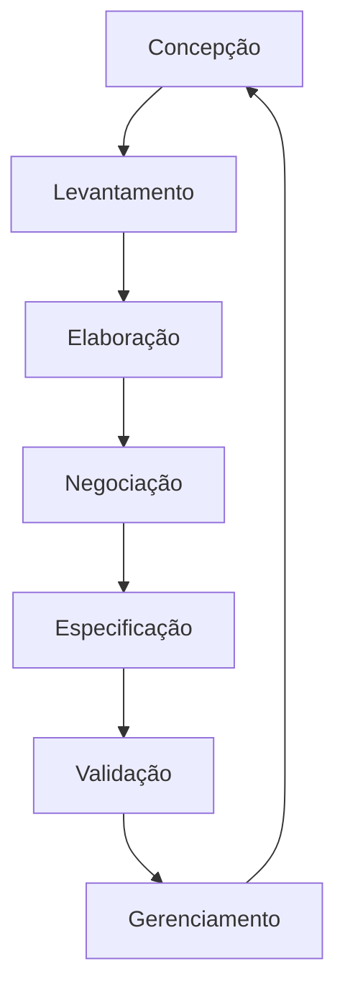
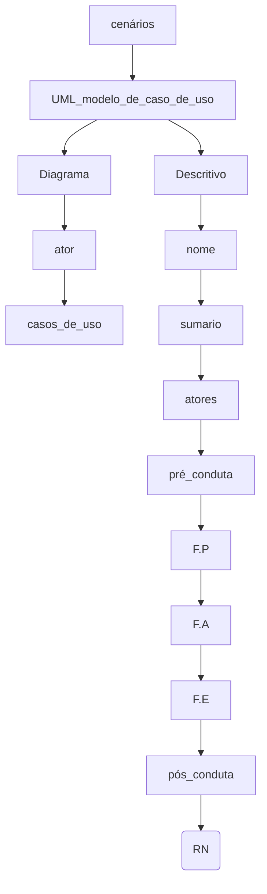

# REVISÃO 
## engenharia de requisitos

## Técnicas - história de usuario 
## CENÁRIOS 
◘ FORMA DE UTILIZAR UM SISTEMA
    
 ◘ Passo para criar um cenário:
         passo 1 : usuário solicita a criação de uma conta
         passo 2 : o sistema apresenta a tela de cadastro
         passo 3 : o usuário deve preencher os dados solicitados no cadastro, nome completo, usuario, senha, confirmação de senha, email e clica no botão para solicitar o cadastro
         passo 4 : sistema faz uma validação dos dados
         passo 5 : sistema exibe mensagem de sucesso, cadastro feito com sucesso, MAS tem que esperar a autorização do administrador para poder fazer login
    ◘ Cenário que contem erros:
         passo 1 : usuário solicita a criação de uma conta
         passo 2 : o sistema apresenta a tela de cadastro
         passo 3 : o usuário deve preencher os dados solicitados no cadastro, nome completo, usuario, senha, confirmação de senha, email e clica no botão para solicitar o cadastro
         passo 4 : sistema faz uma validação dos dados
         passo 5 : nome de usuário inválido, já existe, OU, senha cadastradas não coincidem, OU, email já cadastrado --> ERROS que podem ser encontados em um cenário
         **SENHAS tem que ser iguais para poder fazer login posteriormente
         ** nome de usuario e email são chaves únicas 
---
◘ outro cenário - Recuperação de senha
        passo 1 : erro na tentativa de login, usuario ou senha invalido
        passo 2: clicar em esqueci a senha
        passo 3 : o sistema redireciona para outra pagina, a qual solicita o email para recuperar a senha
        passo 4: o usuario informa o email
        passo 5 : o sistema envia um email para recuperar a senha e envia uma notificação informando que foi enviado o email
        passo 6: usuario acessa o emaiil, clica no link, que redireciona para uma pagina para que ele possa redefinir senha
        passo 7 : o usuario cria uma nova senha e clica em redefinir senha
        passo 8: o usuario faz login, consegue entrar com suceeso

possiveis erro: 
        1- link de recuperação com limite de tempo, e o usuario não respeitou esse limite, então o usuario deve fazer uma nova solicitação de recuperação de senha (volta par passo 2)
        2 - email informado não está cadastrado
         

