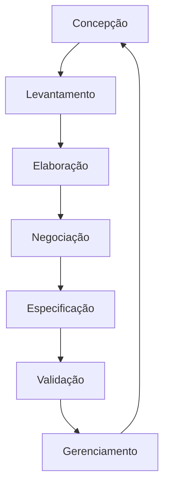
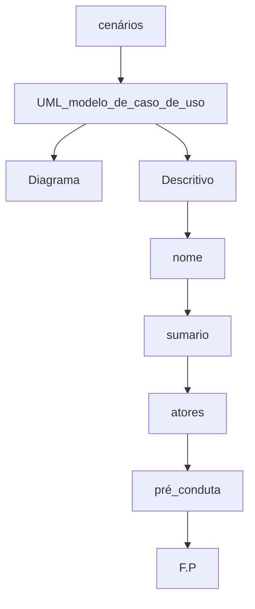

# REVISÃO 
## engenharia de requisitos

```mermaid
graph TD;
    Concepção --> Levantamento;
    Levantamento --> Elaboração;
    Elaboração --> Negociação;
    Negociação --> Especificação;
    Especificação --> Validação;
    Validação --> Gerenciamento;
    Gerenciamento --> Concepção;
```
## técnicas - história de usuario 

```mermaid
graph TD;
cenários --> UML_modelo_de_caso_de_uso;
UML_modelo_de_caso_de_uso --> Diagrama;
UML_modelo_de_caso_de_uso --> Descritivo;
Descritivo --> nome;
nome--> sumario;
sumario --> atores;
atores --> pré_conduta;
pré_conduta --> F.P;


```
