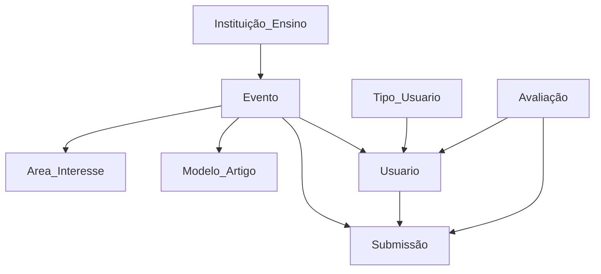

## REVISÃO - aulas anteriores
    🢂 Levantamento e analise de requisitos
         • necessidades: funcionalidades e estruturais
    🢂 Modelagem conceitual 
          • entidades
          • atributos
          • atributos identificadores
          • relacionamento: associação e herança
          • cardinalidade
    🢂 Modelagem lógica
          • atributos estrangeiros ou chaves estrangeiras
              - quem define é a cardinalidade

# MODELAGEM FÍSICA
     🢂 tipos de atributos
     🢂 restrições
           • atributos
           • cardinalidade
           • duplicidade - automática ao se definir uma chave primária
           • dependência - via chave estrangeira
                - delete on: cascade ou restrict

## Exercicio :
         
    Preciso de um sistema web em que se possa gerenciar eventos cientificos, separados por instiutições de ensino. 
    Uma vez que o evento cientifico é gerado, um coordenador autoriza a submissão de trabalhos. Uma submissão de 
    trabalho deve conter: titulo, autores(que devem estar no sistema) , área de interesse (áreas de interesse também
    são gerenciadas pelo sistema), resumo, palavra-chave e o arquivo contendo o artigo. O sistema deve gerenciar 
    modelos de artigos e que serão associados a um evento. Um evento tem um coordenador, um titulo, data de entrega
    de trabalho, modelo de artigo. Uma vez que uma submissão de trabalho é cadastrada, o coodenador do evento precisa
    delegar 2 avaliadores, criando uma avaliação online, em que os avaliadores escreven um parecer e informam SIM ou 
    NÃO ao artigo. Ou seja, ele foi ou não aceito para a publlicação

     🢂 lista de entidades e atributos
         • instituição de ensino - id, nome, sigla
         • eventos - id, nome, data_entrega, quantidade_autores, 
         • trabalho_submissão - id, data, hora
         • usuario - id, nome, cpf, email, fone
         • tipo_usuario - id, descrição  ➞[ membro, coordenador, administrador  (pode alterar qualquer coisa no sistema, não tem restrições, sempre tem que ter em qualquer sistema)]
         • avaliação - parecer, id, data, hora, aceito
         • área de interesse - id, descrição 
         • modelo_artigo -  id, descrição, zip, link_modelo

## Modelo relacional exercicio

         
            
