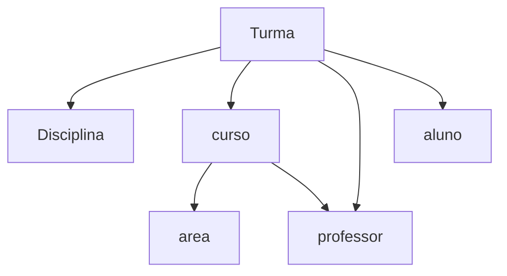

```.java
import java.util.ArrayList;

public class Professor{
    String cpf;
    String nome;
    String email;
    Curso curso;
    ArrayList<Turma>turmas;


    public Professor(String cpf, String nome, String email, Curso curso) {
        this.cpf = cpf;
        this.nome = nome;
        this.email = email;
        this.curso = curso;
    }

    

}
```

```.java
import java.util.ArrayList;

public class Curso{
    String descricao;
    String sigla;
    Area area;
    ArrayList<Aluno>alunos;
    
    public Curso(String descricao, String sigla, Area area){
        this.descricao=descricao;
        this.sigla=sigla;
        this.area=area;
    }
}
```
```.java
public class Area {
    String descricao;
   
  
    public Area (String descricao){
        this.descricao = descricao;
    }
}

```
```.java
import java.util.ArrayList;

public class Aluno{
    String cpf;
    String nome;
    String email;
    ArrayList<Curso>cursos;
    ArrayList<Turma>turmas;

    public Aluno(String cpf, String nome, String email) {
        this.cpf = cpf;
        this.nome = nome;
        this.email = email;
    }

    
}
```
```.java
import java.util.ArrayList;

public class Turma {
    String descricao;
    Curso curso;
    Disciplina disciplina;
    ArrayList<Professor>professores;
    ArrayList<Aluno>alunos;

    
    public Turma(String descricao, Curso curso, Disciplina disciplina) {
        this.descricao = descricao;
        this.curso = curso;
        this.disciplina = disciplina;
    }

    

}

```
```.java
public class Disciplina {
    String nome;

    public Disciplina(String nome) {
        this.nome = nome;
    }
}

```
## Diagramas construidos em aula no MySQL
**o arquivo do MySQL estão na pasta de Diagramas**

### exemplo 1 - turma, exemplo acima


### exemplo 2 - evento cientifico, aula 05 24/03

